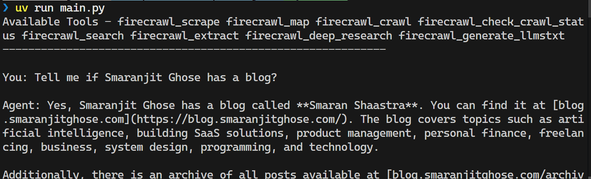

# 🕷️ WebSage

[](https://www.python.org/downloads/)
[](https://openai.com/)
[](https://opensource.org/licenses/MIT)
[](https://firecrawl.dev/)
[](https://modelcontextprotocol.io/)

An intelligent conversational agent that combines OpenAI's GPT models with Firecrawl's powerful web scraping capabilities through the Model Context Protocol (MCP). Chat naturally with an AI that can scrape websites, crawl pages, and extract structured data in real-time.

## 🖼️ Snapshot



## 🔧 Prerequisites

- [Python 3.13](https://www.python.org/downloads/) or higher
- [uv](https://docs.astral.sh/uv/#highlights) (efficient Python Package Management)
- [Node.js](https://nodejs.org/en) (for Firecrawl MCP)
- [OpenAI API](https://platform.openai.com) key
- [Firecrawl](https://www.firecrawl.dev/) API key

## 📥 Installation

1. Clone the project

```
git clone https://github.com/smaranjitghose/websage
```

2. Navigate inside the directory

```
cd websage
```
3. Create a `.env` file and store the API keys from OPENAI and FIRECRAWL as:

```
OPENAI_API_KEY=your-openai-api-key-here
FIRECRAWL_API_KEY=your-firecrawl-api-key-here
```

4. Run the agent using uv (one the first run it will create a virtual environment and install the dependencies in it)

```
uv run main.py
```

5. Start chatting with examples:

```
🗣️  You: Scrape https://news.ycombinator.com and get the top 5 story titles

🗣️  You: Extract all product prices from https://store.example.com

🗣️  You: Crawl https://blog.company.com and summarize the latest 3 articles
```

6. Exit when done:

```
🗣️  You: quit
```


## 💡 Usage Examples

### Basic Web Scraping
```
Scrape https://example.com for main content and headings
```

### E-commerce Data Extraction
```
Get all product names and prices from https://shop.example.com/category/electronics
```

### News and Content Analysis
```
Crawl https://techblog.com and extract all article titles published this month
```

### Research and Data Collection
```
Scrape https://research-site.edu/publications and extract paper titles, authors, and abstracts
```

### SEO and Competitive Analysis
```
Analyze the main headings and meta descriptions from https://competitor.com
```

## 🔍 How It Works

1. **MCP Integration** - Uses Model Context Protocol to connect GPT with Firecrawl
2. **Tool Loading** - Dynamically loads available Firecrawl scraping tools
3. **ReAct Agent** - Employs reasoning and acting pattern for intelligent tool use
4. **Conversation Loop** - Maintains context across multiple scraping requests
5. **Error Recovery** - Handles network issues and API errors gracefully

## 🛡️ Best Practices

### Ethical Scraping
- Always respect `robots.txt` files
- Be mindful of rate limiting and server load
- Only scrape publicly available content
- Consider reaching out to site owners for large-scale scraping

### API Usage
- Monitor your Firecrawl and OpenAI API usage
- Set appropriate rate limits in production
- Cache results when appropriate to reduce API calls

## 🔧 Troubleshooting

### Common Issues


**"Invalid API key" errors**
- Verify your `.env` file is in the correct location
- Check that API keys are valid and have sufficient credits
- Ensure no extra spaces or quotes in the `.env` file

**Connection timeout errors**
- Check your internet connection
- Some websites may block automated requests
- Try with a different website to test functionality

**Python import errors**
```bash
uv add --upgrade mcp langchain-mcp-adapters langgraph langchain-openai python-dotenv
```

## 🤝 Contributing

Contributions are welcome! Here's how:

1. Fork the repository
2. Create a feature branch
```
git checkout -b feature/amazing-feature
```
3. Commit and push your changes
```
git commit -m "Add amazing feature"
git push origin feature/amazing-feature
```
# 4. Open a pull request


## 📝 License

This project is licensed under the MIT License - see the [LICENSE](LICENSE) file for details.

---

Made with ❤️ by [Smaranjit Ghose](https://github.com/smaranjitghose)
